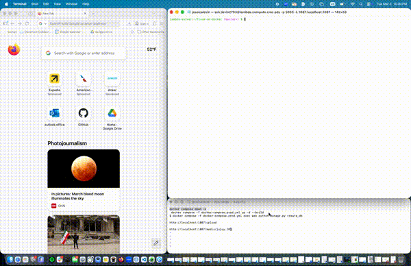

# Flask On Docker


## Overview

This repository contains a Flask web application that’s fully containerized with Docker and set up for both development and production use. It uses PostgreSQL as the database and Docker Compose to manage the services. In production, the app runs with Gunicorn behind an Nginx reverse proxy, and static and uploaded media files are handled through shared Docker volumes. Overall, this project shows how to structure and deploy a production-style Python web application using containers and environment-specific configurations.

#### Video Demonstration


## Build Instructions

#### Build the image and start the containers:
```
docker compose -f docker-compose.prod.yml up -d --build
```
#### Initialize the database:
```
docker compose -f docker-compose.prod.yml exec web python manage.py create_db
```

#### Navigate to the application URL (replace port number with your own) and upload image at 
http://localhost:1337/upload.

#### Then, view the image at
http://localhost:1337/media/IMAGE_FILE_NAME.


